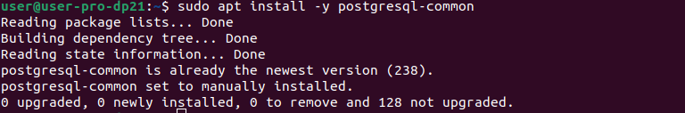
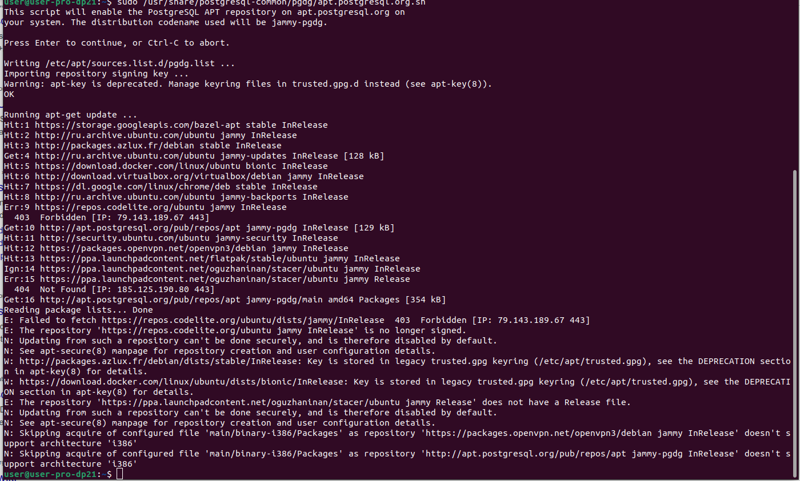
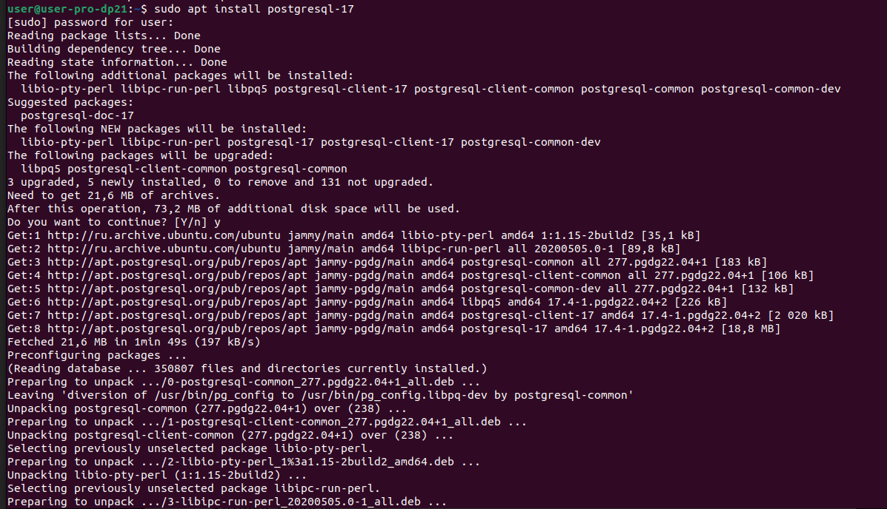
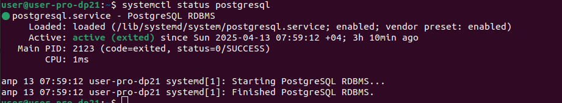
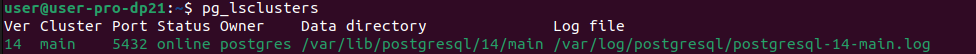
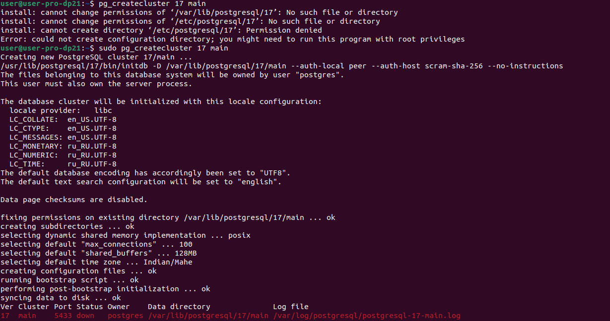
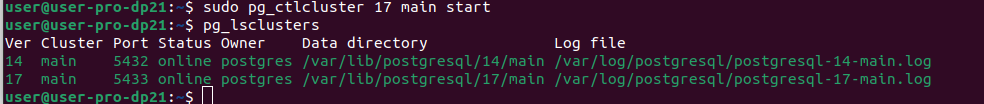

# Установка PostgreSQL

Рассмотрим разные варианты установки PostgreSQL

## Установка на Ubuntu

Рассмотрим установку PostgreSQL на Ubuntu.


Далее описание этапов установки:

1. Зарегистрирован репозитарий командами

   ```
   sudo apt install -y postgresql-common
   sudo /usr/share/postgresql-common/pgdg/apt.postgresql.org.sh
   ```





2. Параметры установки можно настроить в файле /etc/postgresql-common/createcluster.conf
   Установим параметр
   ```
   create_main_cluster = false
   ```
3. Установка postgresql-17 командой
   ```
   apt install postgresql-17
   ```
   


4. Проверка после установки:
  ```
   systemctl status postgresql
   ```



5. Смотрим список кластеров бд командой
   ```
   pg_lsclusters
   ```
   Видим что кластер с postgresql 17 отсутствует в списке. 
   

6. Создаем кластер main postgresql 17
   ```
   pg_createcluster 17 main
   pg_ctlcluster 17 main start
   ```
   

   


7. Правим pg_hba.conf, добавляя разрешение подключаться с определенной ip-адреса (например, 192.168.0.9), добавив строку:
  ```
   host    all             all             192.168.0.9/24          scram-sha-256
   ```
# Установка PostgreSQL в docker

1. Загружаем образ PostgreSQL
   ```
   docker pull postgres:17
   ```
   Пример вывода в консоль команды:

   ```
   user@user-pro-dp21:~$ docker pull postgres:17
   17: Pulling from library/postgres
   8a628cdd7ccc: Pull complete
   e4847368ad17: Pull complete
   97cdd47d9131: Pull complete
   2817206b0512: Pull complete
   3a6f8814136c: Pull complete
   07db60713289: Pull complete
   0c942aac37b1: Pull complete
   8c63b71925de: Pull complete
   97f28320a07a: Downloading [===================>                               ]   45.1MB/112.8MB
   2a08aad74366: Download complete
   6cea4d95608f: Download complete
   c1b7de8085d1: Pulling fs layer
   f15c43cffa70: Download complete
   6948dc7760c1: Download complete 
   ```

2. Создание контейнера с последующим запуском
   ```
   docker run --name test_postgres -e POSTGRES_PASSWORD=postgres -d -p 5435:5432 -v /var/lib/postgres:/var/lib/postgresql/data postgres:17
   ```

3. Подключаемся к бд
   ```
   psql -h localhost -p 5435 -U postgres -d postgres
   ```
4. Создаем таблицу и записываем две строки следующими командами:
```
create table test (name varchar);
insert into test values ('test1'), ('test2');
```
5. Удаляем контейнер командами
```
docker stop test_postgres
docker rm test_postgres
```