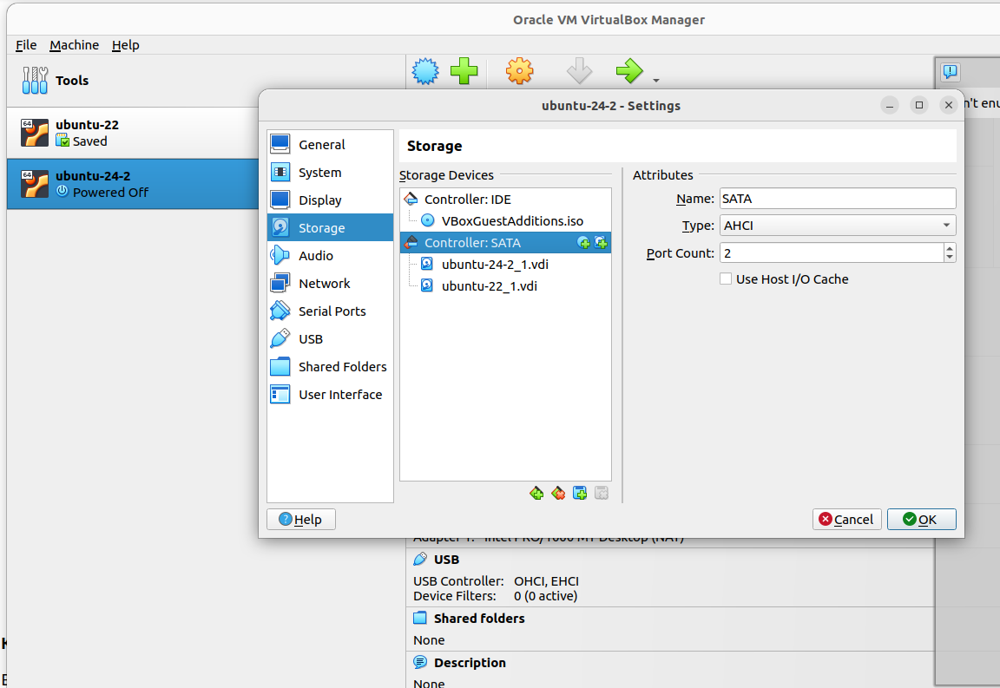

## Цели
* создавать дополнительный диск для уже существующей виртуальной машины, размечать его и делать на нем файловую систему
* переносить содержимое базы данных PostgreSQL на дополнительный диск
* переносить содержимое БД PostgreSQL между виртуальными машинами

## Описание выполнения задания

1. Настроена виртуальная машина (ВМ) virtualbox с ubuntu.
   Установлен postgresql 17.

2. Создана таблица test
```
create table test(c1 text);
```

3. Добавлена запись в таблицу:
```
insert into test values('1');
```

4. Остановлен кластер postgresql
```
sudo -u postgres pg_ctlcluster 17 main stop
```

5. Создан новый диск к ВМ

6. Выполнено форматирование с созданием файловой системы ext4
```
mkfs.ext4 /dev/sdb
```

7. Создан каталог /mnt/data
```
sudo mkdir /mnt/data
```

8. Выполнено монтирование
```
sudo mount -t ext4 -o rw /dev/sdb /mnt/data
```

9. Остановили кластер
```
sudo -u postgres pg_ctlcluster 17 main stop
```

10. Перенесен каталог с данными
```
sudo mv /var/lib/postgresql/17 /mnt/data
```

11. Запущен кластер
```
sudo -u postgres pg_ctlcluster 17 main start
```
Получили ошибку
```
Error: /var/lib/postgresql/17/main is not accessible or does not exist
```
Ошибка запуска, потому что перенесли каталог, содержащий данные и не сообщили об этом postgresql

12. Исправляем в конфигурационом файле
```
/etc/postgresql/17/main/postgresql.conf
```
параметр
```
data_directory = '/var/lib/postgresql/17/main'
```
меняем на
```
data_directory = '/mnt/data/17/main'
```

13. Запускаем кластер
```
sudo -u postgres pg_ctlcluster 17 main start
```

14. Прверяем, что кластер запустился командой:
```
pg_lsclusters
```

15. Запускам psql
```
sudo -u postgres psql
```

16. Выполняем
```
select * from test;
```

Получена запись, добавленную ранее

*
1. Создали еще одну виртуальную машину

2. Удалили /var/lib/postgresql
```
sudo rm -r /var/lib/postgresql
```

3. Добавли к новой ВМ диск, созданный ранее в первой ВМ



4. Создали каталог /mnt/data
```
sudo mkdir /mnt/data
```

5. Выполнили монтирование
```
sudo mount -t ext4 -o rw /dev/sdb /mnt/data
```

6. Исправляем в конфигурационом файле
```
/etc/postgresql/17/main/postgresql.conf
```
параметр
```
data_directory = '/var/lib/postgresql/17/main'
```
меняем на
```
data_directory = '/mnt/data/17/main'
```

7. Запускаем
```
sudo -u postgres pg_ctlcluster 17 main start
```

8. Проверили запуск командой
```
pg_lsclusters
```

9. Запускам psql
```
sudo -u postgres psql
```

10. Выполняем
```
select * from test;
```
Получаем запись, добавленную ранее
